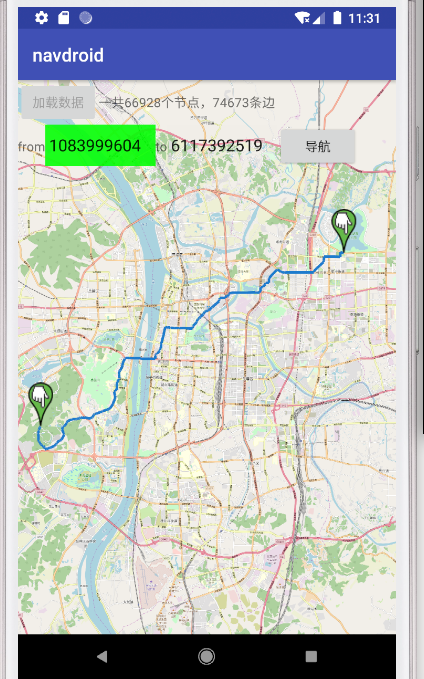
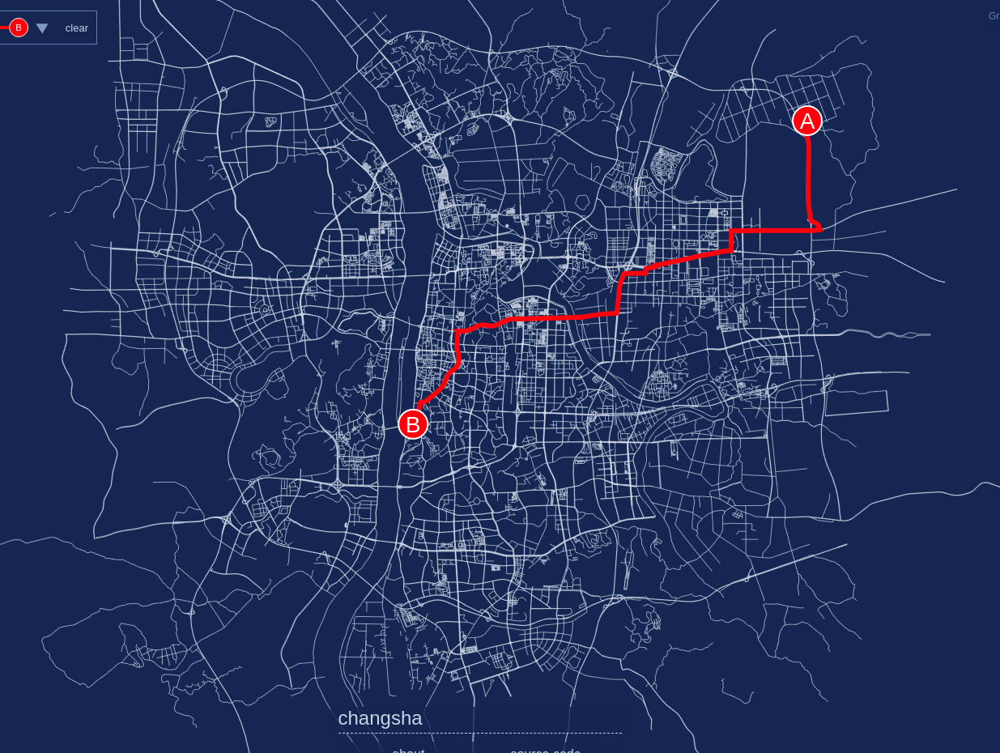
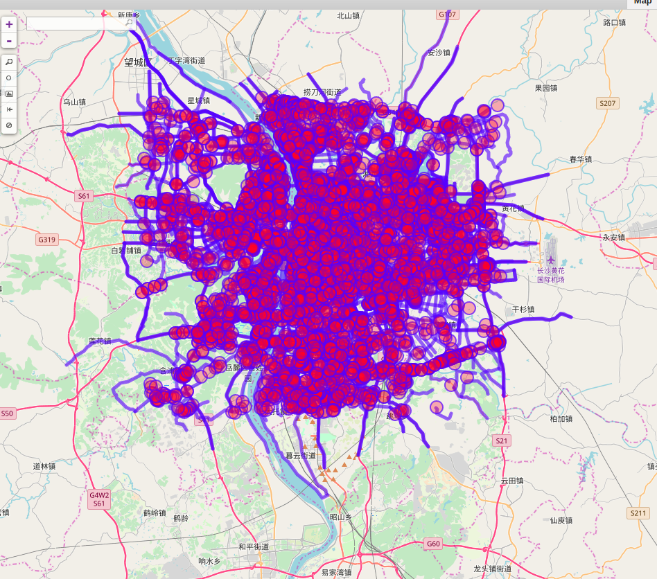

# 一.依赖的最低版本minSDK
## 1.1依赖的JAVA SDK最低版本
JAVA SDK 1.8.0_201
## 1.2依赖的Android SDK最低版本
Android SDK 8.0(Oreo) API 27

# 二.AAR包使用方法：
## 2.1先添加到build.gradle中
    repositories {
        flatDir {
            dirs 'libs'
        }
    }
## 2.2拷贝aar包到libs
    拷贝cjtastar.aar包到libs文件夹中
## 2.3在build.gradle中添加
    implementation 'com.eclipsesource.j2v8:j2v8:4.5.0@aar'
    implementation(name: 'cjtastar', ext: 'aar')
## 2.4在使用算法之前初始化v8引擎（执行一次）
```
public void onCreate(Bundle savedInstanceState) {
    super.onCreate(savedInstanceState);
    AStar.initV8();
}
```
## 2.5读取路网数据（执行一次）
```
AStar.astarReadGraph(mainActivity.cjtGraph);
```
## 2.6执行算法进行计算最短路径，需输入起始和结束点（可执行多次）
```
List<CjtNode> result = AStar.astarNavRoad(fromId, toId);
```
## 2.7在最后程序退出或者不再使用算法时销毁v8引擎（执行一次）
```
protected void onDestroy() {
    AStar.initV8();
    super.onDestroy();
}
```
# 三.示例DEMO安卓APP使用方法：

## 3.1安卓APP样例DEMO截图：



## 3.2长沙路网数据

- 先点击“加载数据”按钮，稍等片刻，进度条完成，上方提示信息会显示当前加载多少条数据
- 起始点框为绿色时，在地图上长按，可以采集到起始点，起始点框内获得起始点的ID，同时地图上现实起始点的位置。
- 鼠标点击结束点框，当结束点框为绿色时，在地图上长按，可以采集到结束点，结束点框内获得起始点的ID，同时地图上现实结束点的位置。
- 点击“导航”按钮，即可现实得到的最短路径。

# 四.数据说明

## 4.1长沙路网数据



## 4.2数据源来自OSM：

